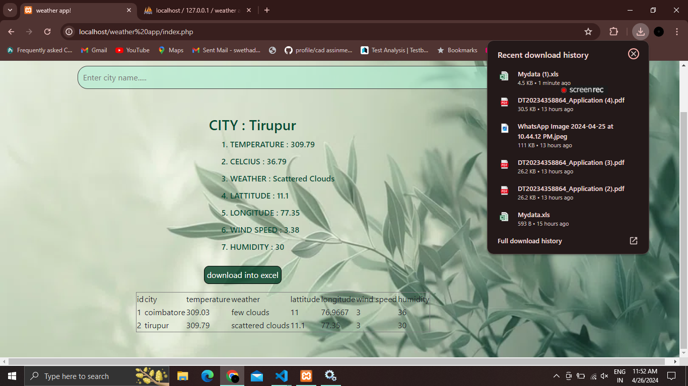
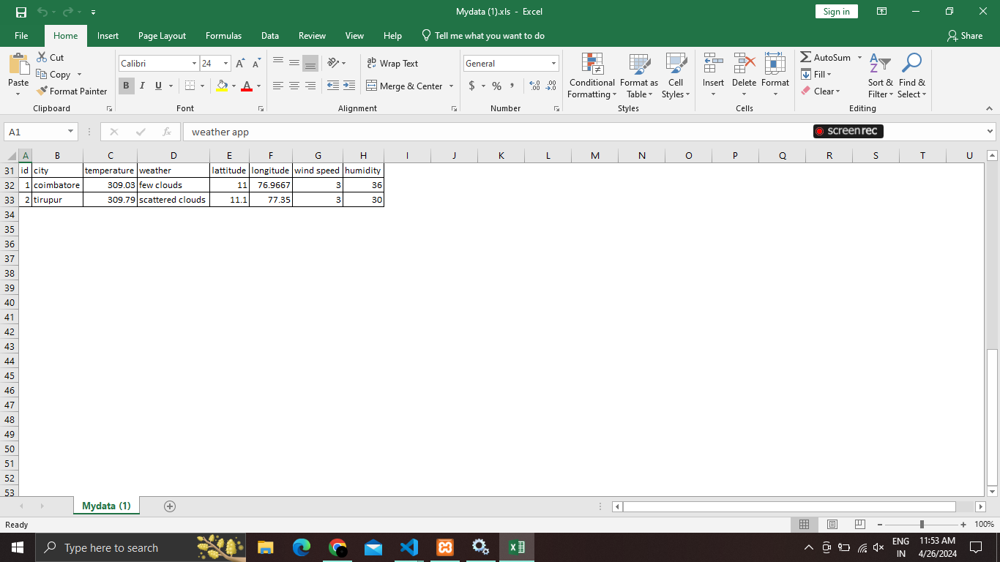
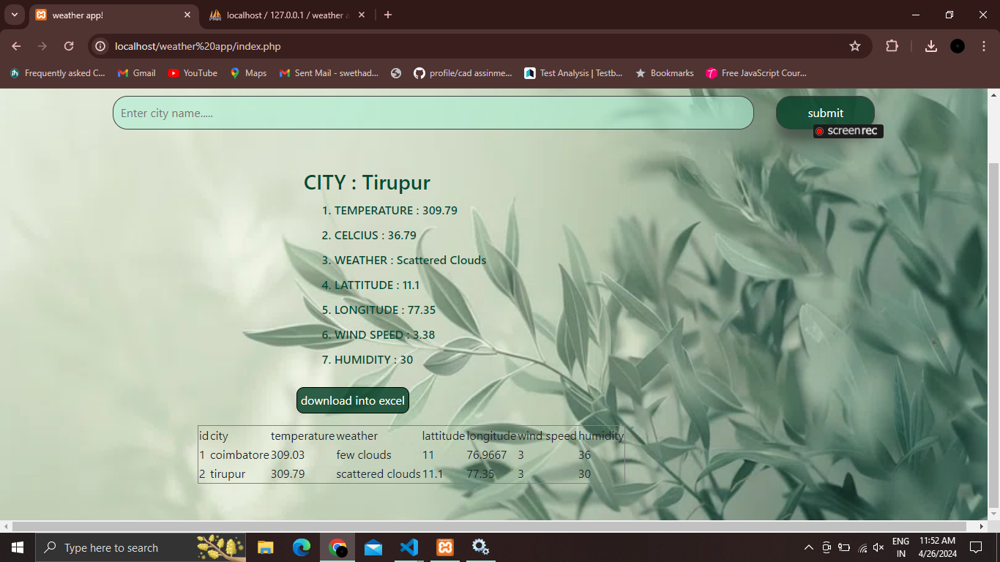

# weather-app

>i have created a weather app which tells about temperature ,celcius ,lattitude ,longitude,wind speed,humidy in your city
>in this project i used open weather api to fetch the current weather details and implemented in php along with scss for styling the websites

>i have added database to this project when you enter a city and submit it will be udated in database and you can download the file as excel

--output of my project will be like:

<picture>

  
</picture>
